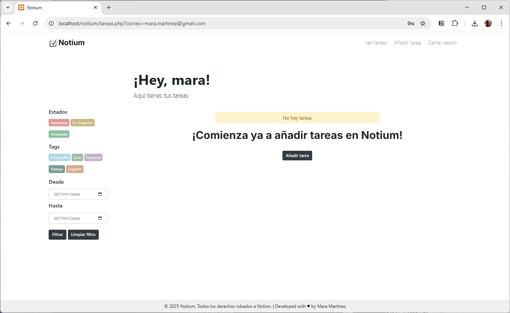
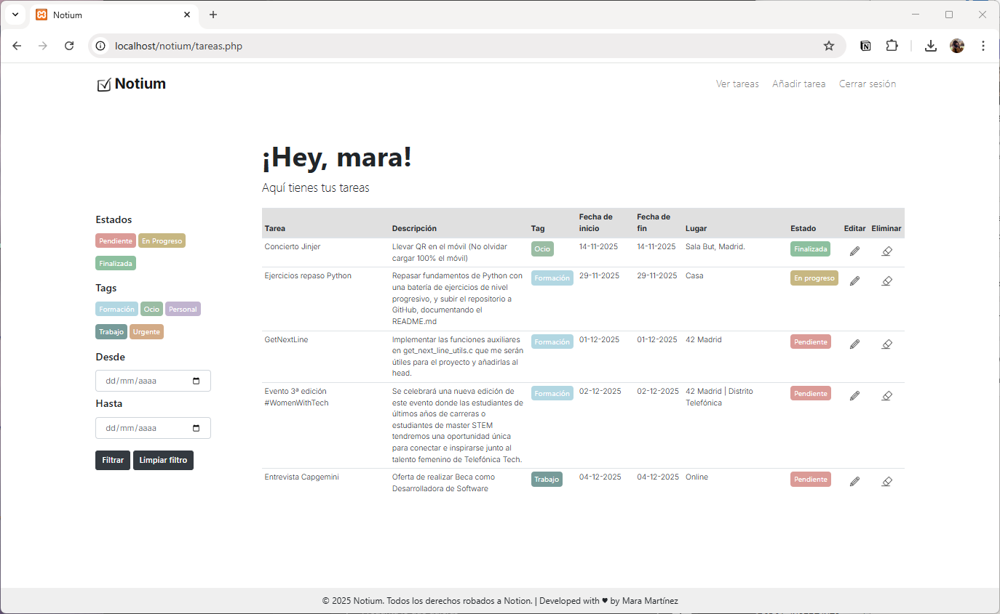
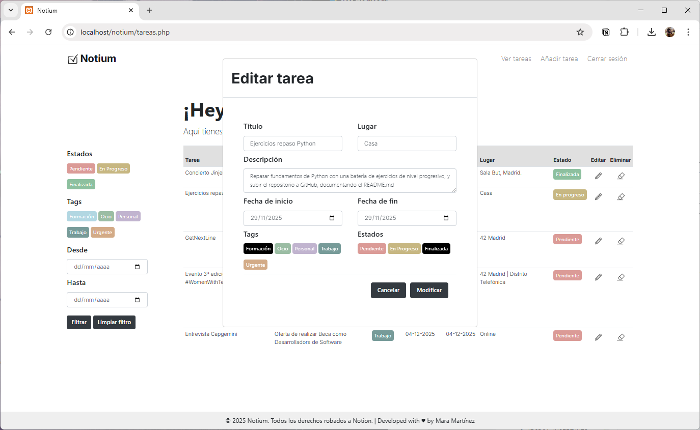

# Notium

Aplicación web de gestión de tareas desarrollada para la asignatura de **Programación** del **Grado Superior en Desarrollo de Aplicaciones Multiplataforma**.
Permite **registrar usuarios, iniciar sesión y gestionar tareas** mediante un sistema CRUD completo: creación, edición (con modal), filtrado y eliminación.

## Tecnologías utilizadas

* **PHP 8+**
* **MySQL**
* **Bootstrap 4.5**
* **HTML5 + CSS3**
* **XAMPP / Apache**

## Funcionalidades principales

### Autenticación

* Registro con contraseña encriptada.
* Inicio de sesión mediante cookie.
* Redirecciones automáticas según sesión activa.
* Cierre de sesión con borrado de cookies.

### Gestión de tareas

* Crear nuevas tareas con:

  * Título
  * Descripción
  * Fecha de inicio y fin
  * Lugar
  * Tag (categoría con color)
  * Estado (Pendiente, En progreso, Finalizada)
* Listado de tareas con:

  * Tags coloreados dinámicamente desde BD.
  * Estados con badges personalizados.
  * Formateo de fechas (dd-mm-yyyy).
* Edición mediante **modal de Bootstrap**.
* Eliminación de tareas.

### Filtro avanzado

Permite filtrar por:

* Estado
* Tag
* Rango de fechas

Incluye botón para limpiar los filtros.

## Capturas de pantalla

<p align="center">
  
</p>

<p align="center">
  
</p>

<p align="center">
  
</p>

<p align="center">
  
</p>

<p align="center">
  
</p>

<p align="center">
  
</p>

<p align="center">
  
</p>


---

## Instalación

### 1. Clonar el repositorio

```bash
git clone https://github.com/maramartinezvargas/Notium
```

### 2. Configurar la base de datos

Importar `notium.sql` (incluido en el repositorio).

Crear la base de datos:

```sql
CREATE DATABASE notium;
```

Importar desde consola:

```bash
mysql -u root -p notium < notium.sql
```

El archivo incluye:

* Tabla `usuarios`
* Tabla `tags`
* Tabla `tarea`
* Tags por defecto y datos de prueba

### 3. Configurar la conexión

Editar `conexion.php` si es necesario:

```php
$conexion = new mysqli("127.0.0.1", "root", "campusfp", "notium");
```

### 4. Ejecutar el proyecto

Colocar el repositorio en `htdocs` y acceder a:

```
http://localhost/notium/
```

---

## Estructura del proyecto

```
/
├── img/                # Imágenes, iconos y capturas
├── index.php           # Página de inicio, registro y login
├── tareas.php          # CRUD completo de tareas
├── conexion.php        # Conexión MySQL
├── navbar.php          # Barra de navegación
├── footer.php          # Footer fijo
├── politicas.php       # Políticas de privacidad
├── styles.css          # Estilos personalizados
└── notium.sql          # Base de datos completa
```

---

## Seguridad (nivel académico)

Incluye:

* Contraseñas hasheadas (`password_hash`)
* Validación básica
* Gestión de sesión mediante cookies
* Restricción de acceso a páginas internas
